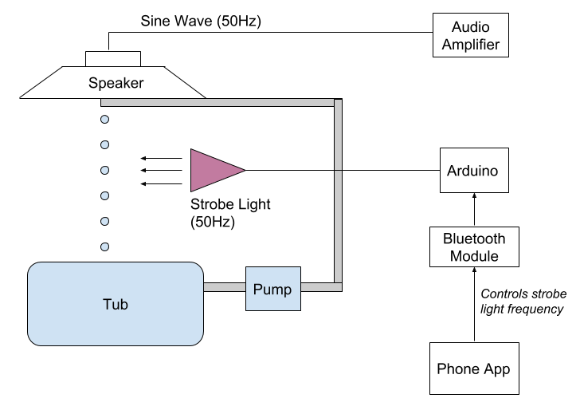

# Strobe Light Fountain
###### Video [here](https://youtu.be/b8qxHUh3Le0).

### Introduction

A strobe light, commonly called a strobe, is a device used to produce regular flashes of light.

To achieve a stroboscopic effect, special calibrated strobe lights, capable of flashing up to hundreds of times per second, are used in industry to stop the appearance of motion of rotating and other repetitively operating machinery and to measure, or adjust, the rotation speeds or cycle times. Since this stop is only apparent, a marked point on the rotating body will either appear to move backward or forward, or not move, depending on the frequency of the strobe-flash.

###### Stroboscopic Effect

 

------

### Our Project

The goal of the project was to illuminate, with a strobe light, a stream of falling water that was forming blobs at a specific frequency. This would give an illusion of the blobs staying stationary in space, falling at a controlled speed or moving up against gravity.

### Working

The opening end of a pipe was attached to a speaker. A specific frequency -- 50Hz, was played on the speaker. Thus, even though the falling water stream seemed continuous to the naked eye, blobs of water were being formed at 50 blobs/sec. A strobe light running at 50Hz was used to achieve the stroboscopic effect, wherein the blobs would appear to be stationary in space --  defying gravity. Controlling the strobe frequency about 50Hz allowed to create the illusion of the blobs moving upwards / downwards at a controlled speed.

### Setup

### Video

Project video [here](https://youtu.be/b8qxHUh3Le0).
